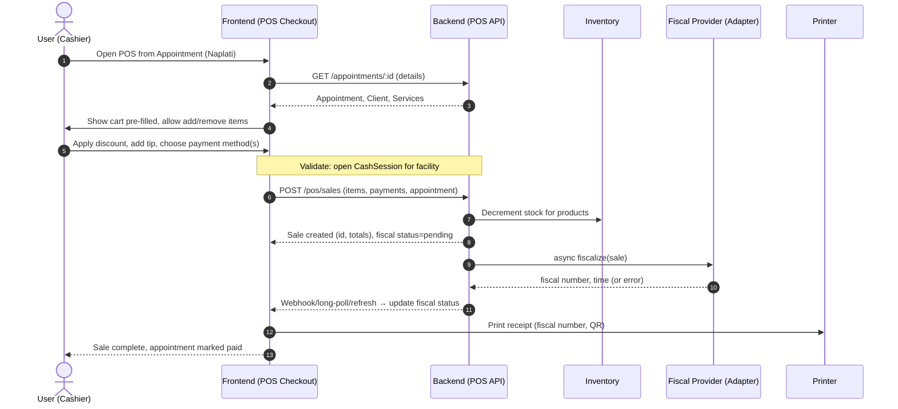
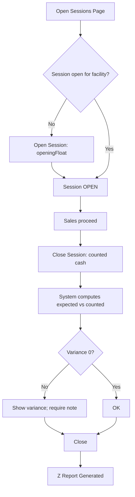
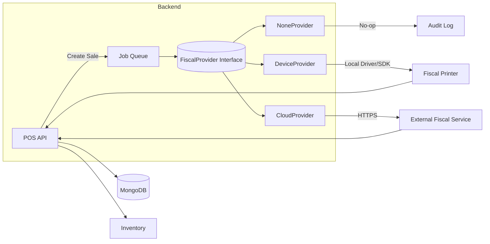

# POS (Point of Sale) — Key Flows and Architecture

Below are high-level visual diagrams to quickly understand how POS is designed to work in the salon app. These render in editors that support Mermaid (Cursor, VSCode with Mermaid, GitHub, etc.).

## 1) Appointment-based Sale (from calendar)


## 2) Direct Sale (without appointment)
```mermaid
flowchart LR
    A[Open POS Checkout] --> B[Search/Add Services & Products]
    B --> C[Apply Discount / Tip]
    C --> D{Open CashSession?}
    D -- No --> E[Prompt to open session]
    E --> D
    D -- Yes --> F[Choose Payment(s)]
    F --> G[POST /pos/sales]
    G --> H[Update Inventory]
    H --> I[Queue Fiscalization]
    I --> J[Receipt Printed]
    J --> K[Done]
```

## 3) Refund (full or partial)
```mermaid
sequenceDiagram
    autonumber
    actor U as User (Manager/Cashier)
    participant FE as Frontend (Sales History)
    participant BE as Backend (POS API)
    participant INV as Inventory
    participant FIS as Fiscal Provider

    U->>FE: Open Sale details → Refund
    FE->>BE: GET /pos/sales/:id
    BE-->>FE: Sale details
    U->>FE: Select items/amount to refund
    FE->>BE: POST /pos/sales/:id/refund (partial/full)
    BE->>INV: Increment stock for returned items
    BE-->>FE: Refund sale created, status pending fiscal
    BE->>FIS: fiscalize(refund)
    FIS-->>BE: fiscal number or error
    BE-->>FE: Update status; FE shows success and prints refund receipt
```

## 4) Cash Session — Open / Close


## 5) Fiscalization Architecture (Adapter + Queue)


## 6) Scenarios covered now (MVP)
- Appointment-based sale
- Direct sale (bez termina)
- Refund (full/partial)
- Cash session open/close, variance, Z-report
- Fiscalization pipeline with replaceable providers

## 7) Notes
- Tenant/Facility enforced from JWT + validation
- Multiple payment methods per sale; cash change handled
- Inventory sync on sale/refund
- Idempotent fiscalization via correlationId; retries on failure
- Printable receipt with tenant logo and fiscal number/QR
